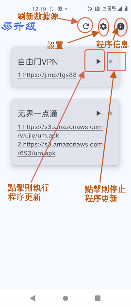
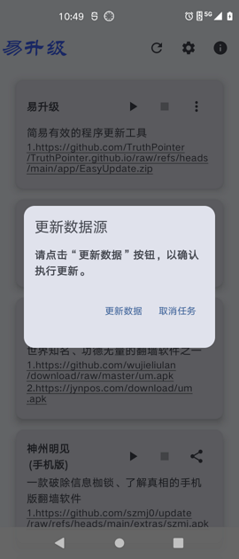
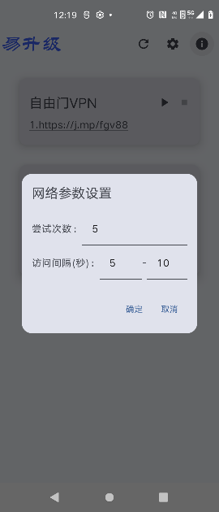
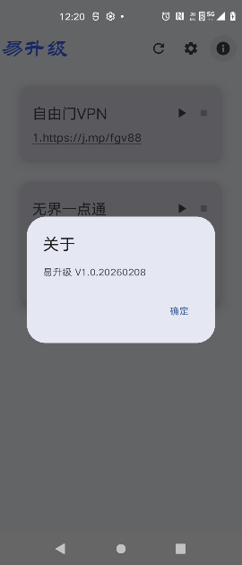
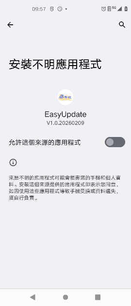
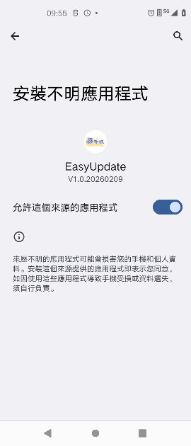

# “易升級”使用簡要説明

## 一、程序簡介

翻墻軟件一旦安裝后，存在如何更新的現實問題，特別是翻墻軟件本身不提供或不能提供很好的自動更新功能時，對於衆多世人，他們可能不得不面對不熟悉的Android系統、不熟悉文件管理器的使用、不知道怎麽完成壓縮后的翻墻軟件的解壓以及安裝等，這每一件看起來細小的事情，對比較熟悉Android系統的人來説都是極爲簡單的事情，卻都會導致在其翻墻軟件失效后無法有效更新，從而成爲造成他們“與世界失聯”的關卡。

本程序則是借助翻牆軟體官方提供的穩定的最新版程序下載鏈接，不是通過翻牆程序，只是通過簡單的多次直連嘗試的“笨”辦法，實現翻墻軟件的下載、解壓、安裝的全過程，最大成度降低更新的難度，以應對翻牆軟體安裝後所面對的特殊情況下的更新困局。

 
## 二、開發環境等

|  類別  |說明|
| :---   | :---        |
|開發工具	|Android Studio 2025.3.1|
|語言|Kotlin|
|适合的Android系统|7.0+|
|官方库之外引用的庫|zip4j, gson|

## 三、使用簡要說明

1、程序界面及部分菜單
界面展示了加入的翻墻軟件名稱及其官方提供的下載鏈接

2、各個翻墻軟件的下載連接都可能發生改變，程序會嘗試更新最新的數據。

3、下載的網絡參數設置

（1）嘗試次數：更新時最大連續嘗試更新的次數；

（2）訪問間隔：每次嘗試訪問之間的時間間隔的調整，如圖，會在5-10秒之間隨機暫停若干秒，再進行下一次嘗試。

4、程序版本信息

5、使用本程序成功下載翻墻程序后，會進入到安裝程序步驟。在使用本程序首次執行安裝操作時，因爲安裝需要用戶授權，因此會跳轉到Android系統提供的授權界面，請在“允許這個來源的應用程式”右側的切換按鈕那裏點擊一次，以完成授權。

6、安裝權限獲得授權后的狀態

7、進入到程序的安裝界面

8、安裝完成時的界面

## 四、程序願望

望您藉助自由門和無界等安全的翻墻軟件，瞭解世界真相，瞭解大法真相，愿您未來光明而美好！

